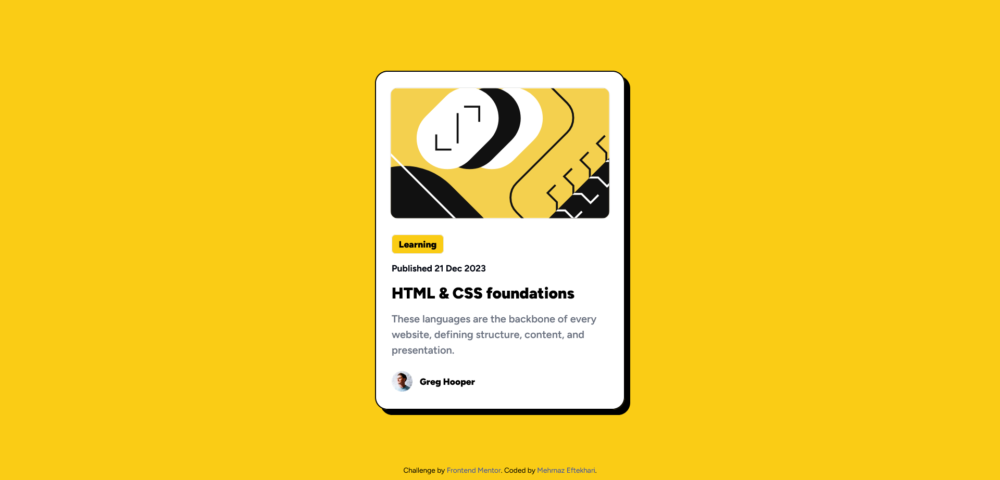
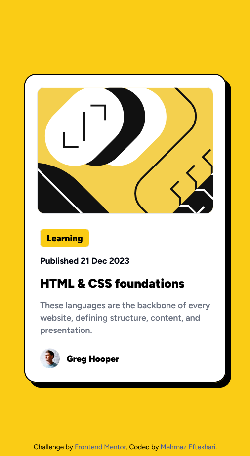

# Frontend Mentor - Blog preview card solution

This is a solution to the [Blog preview card challenge on Frontend Mentor](https://www.frontendmentor.io/challenges/blog-preview-card-ckPaj01IcS). Frontend Mentor challenges help you improve your coding skills by building realistic projects.

## Overview

### Links

- Solution URL: [Add solution URL here](https://github.com/mehrnaz98/blog-preview-card.git)
- Live Site URL: [Add live site URL here](https://magical-croissant-b53d81.netlify.app/)

### Screenshot

### Built with

- Semantic HTML5 markup
- CSS custom properties
- Tailwind
